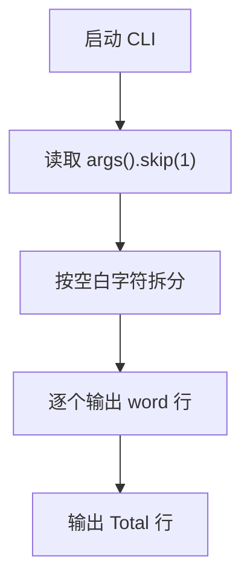

# HLD - word-count

## 架构目标

该测试仓库采用单文件 Rust CLI 架构，用最小实现验证命令行输入解析、输出顺序和验收脚本兼容性。

## 组件设计

| 组件 | 职责 |
| --- | --- |
| `Cargo.toml` | 声明 Rust 包元数据。 |
| `src/main.rs` | 读取参数、拆分词元、打印词元与总数。 |

## 执行流程

## 技术决策

输入规模很小，使用标准库迭代器即可完成需求。无需错误处理框架、配置文件或第三方 CLI 解析库。
